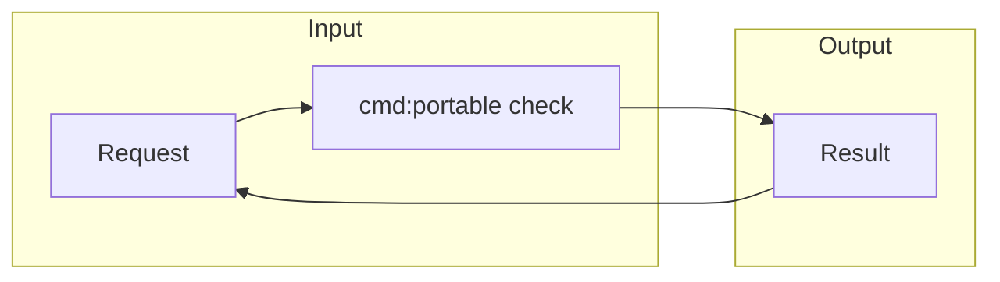

# Portable Service

[中文](README_CN.md) | [English](README_EN.md)

<picture>
  <source media="(prefers-color-scheme: dark)" srcset="docs/assets/banner-dark.svg#gh-dark-mode-only">
  
</picture>

<!-- governance:section:value-proposition -->
把请求转换成可验证的本地结果。

## 状态

<!-- governance:section:status -->
示例服务已可在本地运行。

## 快速开始

<!-- governance:section:quick-start -->

1. 运行 `portable check`。
2. 查看 `PASS` 结果。

<!-- governance:quick-start:expected-result -->
预期输出：`PASS`。

<!-- governance:quick-start:doctor -->
失败时运行 `portable doctor`。

## 按角色继续

<!-- governance:section:personas -->

- 使用者：[使用指南](https://example.invalid/portable-service/user)
- 贡献者：[贡献指南](https://example.invalid/portable-service/contributor)
- 维护者：[维护指南](https://example.invalid/portable-service/maintainer)

## 目录说明

<!-- governance:section:repository-navigation -->
源码、文档和配置各自保持独立目录。

## Git 治理标准 / Git Governance Standard

<!-- governance:section:git-workflow -->
Commit types: feat, fix, docs, style, refactor, perf, test, build, ci, chore.
Branches: main, develop, feature, test, release, hotfix.
Release notes 按主类型汇总。

## 架构

## 能力

<!-- governance:section:capabilities -->
<!-- governance:capability-showcase:start -->
- **Parser** — 把输入转换成结构化结果。[详情](https://example.invalid/portable-service/parser)
<!-- governance:capability-showcase:end -->

## 四象限演进

<!-- governance:section:evolution -->
<!-- governance:evolution-quadrants -->

| 象限 | 当前认知 | 沉淀资产 |
|---|---|---|
| <!-- quadrant:known-known --> 已知的已知 | 请求格式 | 回归测试 |
| <!-- quadrant:known-unknown --> 已知的未知 | 峰值负载 | 性能计划 |
| <!-- quadrant:unknown-known --> 未知的已知 | 运维经验 | 故障指南 |
| <!-- quadrant:unknown-unknown --> 未知的未知 | 未探索风险 | 探针 backlog |

## Star History

[公开 Star History 页面](https://star-history.com/#example/portable-service&Date)
